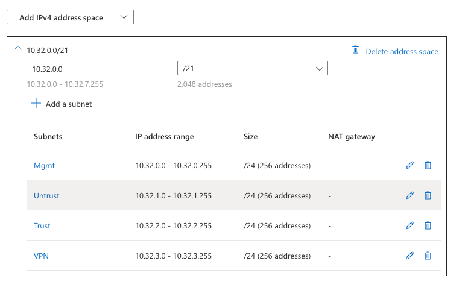

# Build Azure Environment

### Information Needed to complete:
* Azure Subscription
* Resource Group Name
* Azure Region
* Authentication method (password or ssh public key)
* Username
* Password (can be autogenerated and passed)
* IP range that doesn't conflict with existing IP addresses.
* VM Name
* Public DNS name for mgmt

### Select Firewall From Marketplace
1. Log into Azure and from the top search bar search for marketplace.\

2. Search the Marketplace for Palo Alto
3. Select create on M-Series Next-Generation Firewall from Palo Alto
4. Select VM-Series Virtual Next Generation Firewall (BYOL)\

### Configure VM Basics
1. Create new Resource Group and populate a logical name
2. Select the correct region
3. Enter in your username
4. Enter in your password (SSH Public Key to come later)
5. Select Next.\

### Configure Networking
1. Under Virtual Network click on Edit virtual network.
2. Enter in a logical name for the virtual network.\

3. Adjust your address space so there aren't overlaps with existing IP space.
4. We will add the VPN subnet later. If you try and add it here the Azure PA template will not configure it.
5. Change the name to VPN (this will enable us to create a VPN zone on the firewall). NOTE: We have to enable UDR but that is done later.
6. Select add.\

1. All zones:\

1.  Click save.
2.  You may not see the VPN Subnet listed and that is ok.\

1.  Click Next.

### Configure VM-Series Configuration
1.  Click Create new under Public IP address:
    a. Give it a logical name.
    b. Sku: Basic
    c. Assigmnment: Dynamic
    d. Click ok\

2.  Enter in a DNS name (this will be the FQDN to manage the firewall)
3.  Make sure the Virtual Machine Size is at least a D3v2 (4 vcpus and 14 GB memory)\

4.  Select review + create

### Review and Create
1.  Verify everything looks correct and click create.
2.  This will take about 5-10 minutes

Add:
* DNS for untrust (dynamic peering)
* Correct Trust routing
* VPN Subnet
