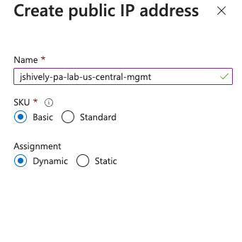

# Build Azure Environment

### Information Needed to complete:
* Azure Subscription
* Resource Group Name
* Azure Region
* Authentication method (password or ssh public key)
* Username
* Password (can be autogenerated and passed)
* IP range that doesn't conflict with existing IP addresses.
* VM Name
* Public DNS name for mgmt

### Select Firewall From Marketplace
1. Log into Azure and from the top search bar search for marketplace.\

2. Search the Marketplace for Palo Alto
3. Select create on VM-Series Next-Generation Firewall from Palo Alto
4. Select VM-Series Virtual Next Generation Firewall (BYOL)\

### Configure VM Basics
1. Create new Resource Group and populate a logical name
2. Select the correct region
3. Enter in your username
4. Enter in your password (SSH Public Key to come later)
5. Select Next.\

### Configure Networking
1. Under Virtual Network click on Edit virtual network.
2. Enter in a logical name for the virtual network.
3. Adjust your address space so there aren't overlaps with existing IP space. I also adjust it down to a /21 or /22 vs. the default /16.\

4.  Click save.
5. Verify you have a Virtual network and three subnets (Management, Untrust, and Trust). We will add a VPN zone in later. If we add it now the Azure PA template won't recongize it.

1.  Click Next.

### Configure VM-Series Configuration
1.  Click Create new under Public IP address:
    a. Give it a logical name.
    b. Sku: Basic
    c. Assigmnment: Dynamic
    d. Click ok\

2.  Enter in a DNS name (this will be the FQDN to manage the firewall)
3.  Make sure the Virtual Machine Size is at least a D3v2 (4 vcpus and 14 GB memory)\

4.  Select review + create

### Review and Create
1.  Verify everything looks correct and click create.
2.  This will take about 5-10 minutes
3.  It will take another 10-15 minutes after deployment is complete for the Firewall mgmt to be accessible.