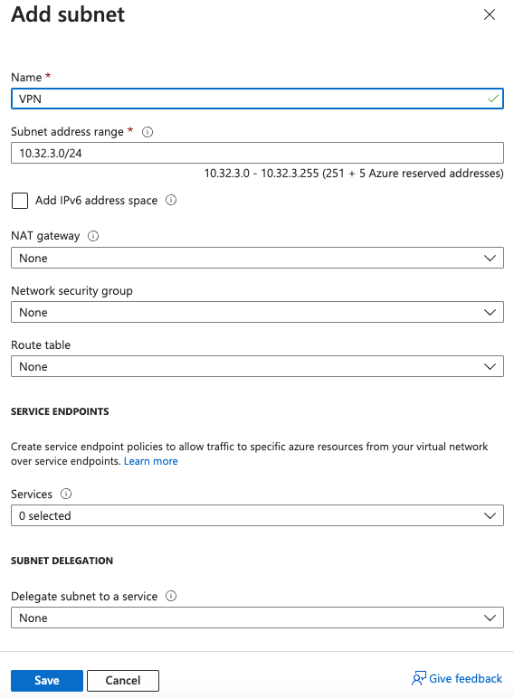

# Configure Azure Environment

### Information Needed to complete:
* Subnet for VPN Zone
* Know the subnet for trust
* DNS name to use for untrust interface

### Find the Resource Group
1. From Azure home enter in resource groups and click on resource groups.\

2. From Resource Groups search for the resource group you created in the previous step and select it.\

### Add a Subnet for VPN (From the Resource Group)
1. Select the Virtual network that was created in the previous step.\
2. On the left side toolbark click on Subnets.
3. From the subnets click on +subnet.
4. Name it VPN and press save.\

### Create Public DNS for Trust Zone
This will allow dynamic peering of IPSec tunnel via DNS name on untrust.

1. From the resource group click on the Network Interface that ends in eth1. This is the unttrust interface used by PA.

2. On the left toolbar select IP Configurations.
3. Click on the ipconfig-untrust interface.

4. Select Associate public IP address.
5. Click on create a public ip address under the dropdown.
6. Give it a logical name
7. Change assignment to static.
8. Click Ok

9. After a minute the ipconfig-untrust should populate with an external address.
10. From resource group you will see a new Public IP address, click on that, and you will see the DNS record that was created.

11. You can validate it works by pinging or nslookup. Please note it will not return any pings.

###

Add:
* DNS for untrust (dynamic peering)
* Correct Trust routing
* VPN Subnet
