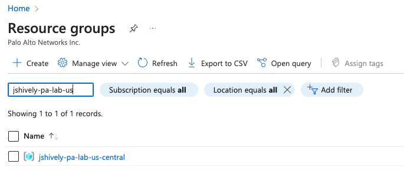

# Configure Azure Environment

### Information Needed to complete:
* Subnet for VPN Zone
* Know the subnet for trust
* DNS name to use for untrust interface
* Trust subnet range

### Find the Resource Group
1. From Azure home enter in resource groups and click on resource groups.\

2. From Resource Groups search for the resource group you created in the previous step and select it.\

### Add a Subnet for VPN (From the Resource Group)
1. From the resource group click on create and type in network interface.
2. Enter in a name.
3. Change virtual network to the virtual network you created when you built this resource group.
4. Under subnet click on edit subnet.
5. Change the name to VPN.
6. It should select the next available /24 out of your pool.\

7. Click save.\

1. Click review + create
2. Click create.

### Create Public DNS for Trust Zone
This will allow dynamic peering of IPSec tunnel via DNS name on untrust.

1. From the resource group click on the Network Interface that ends in eth1. This is the unttrust interface used by PA.\

2. On the left toolbar select IP Configurations.
3. Click on the ipconfig-untrust interface.\

4. Select Associate public IP address.
5. Click on create a public ip address under the dropdown.
6. Give it a logical name
7. Change assignment to static.
8. Click Ok\

9. After a minute the ipconfig-untrust should populate with an external address.
10. From resource group you will see a new Public IP address, click on that, and you will see the DNS record that was created.\
\

11. You can validate it works by pinging or nslookup. Please note it will not return any pings.

### Configure User Define Route for trust
By default Azure will send all traffic to .1 on the subnet which is their gateway. We want to have all trust traffic go to the Palo Alto interface (trust subnet .4 by default).

1. From the resource group click on create.
2. Search for route table in the box.\

3. Select create route table.
4. Under the basics enter in a logical name.\

5. Click next.
6. Enter in any tags that are required.
7. Click next.
8. Review and press create. This will take a couple of minutes.

9. From the resource group click on the newly created route table.
10. On the left screen click on routes and select add.
11. Enter in a logical route name
12. Destination type will be IP address.
13. Destination IP will be 0.0.0.0/0
14. Next hop type is Virtual appliance.
15. Next hop address is the PA's IP address for trust (interface2 from the resource group)
16. Click Add.\

17. Click on Subnets in the left side of the screen.
18. Click on Associate.
19. Find your Virtual Network in the drop down box.
20. Subnet should be trust.
21. Click ok.\

22. Overview should now show a route pointing to trust interface and trust associated under subnets.\

