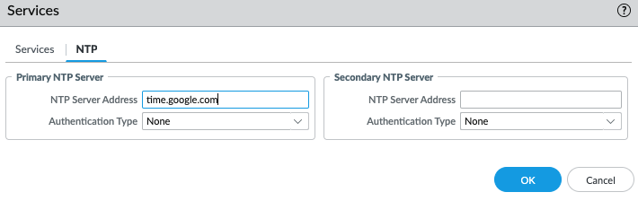

# Configure a VM PA Firewall

### Information Needed to complete:
* PA MGMT (IP or FQDN)
* PA username and password
* PA support account
* NTP server (time.google.com is a good public)

### Register the device
1. Log into the PA firewall and from the Dashboard record the CPU ID and UUID. Please note the serial # will report unkonwn.\

2. Log into the PA support portal and select Products -> VM-Series-Auth-Codes.
3. Enter in the UUID and CPUID from the PA along with the OS Release and Virtual Platform.\

4. Press submit and complete the form with your address information and pres submit. Close this box after you see a green box at the top letting you know it has been registered successfully.
5. From the Palo Alto FW select device on the top and then license on the left side.\

6. Click on Retrieve license  keys from license server and wait aboutfive minutes. You might have to log back in after the license is applied.
7. You should now see under Dashboard a Serial Number has been assigned.


### Set the timezone and NTP.
1. From the PA device tab click on Setup.
2. Select services and click on the gear icon on the services box.\

1. Under the NTP tab enter in your NTP server. I normally use time.google.com.

2. Under the Setup management tab click on the gear icon under General Settings.\

3. Update your timezone to the correct timezone.
4. Click on Commit in the top right, enter in a description, and press commit. This will take less than a minute.\

5. If you want to verify from the CLI you can ssh into the PA. To verify ntp enter in ```show ntp``` and to verify time enter in ```show clock```. NOTE: It might take a couple minutes for the ntp status to change from rejected to synched.\


### Update OS

1. Click on device -> Software. The first time you load this it might say Operation Failed No update information available. Click close and on the bottom left of the screen click on Check Now.

2. Select download under the version you want to install.

3. After the image is downloaded, refresh the screen, and select validate. This process will take another minute.

4. After the image is validated, refresh the screen, and select install.
5. This process will take 15-20 minutes and require a reboot.\
