# General Network Config for PA Firewall

### Table of Contents

### Information Needed to complete:
* PA MGMT (IP or FQDN)
* PA username and password
* Azure Resource Group (IP addresses for PA have been assigned in Azure)

### Create Zones
1. From the PA select Network -> Zones.
2. Click on Add in the bottom right.
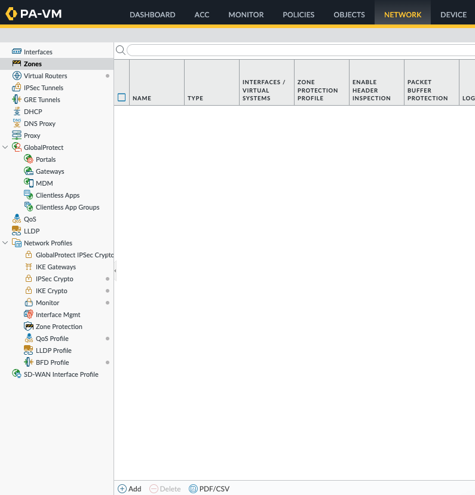
3. Under Name enter in untrust and Type select Layer3. Click on Ok.
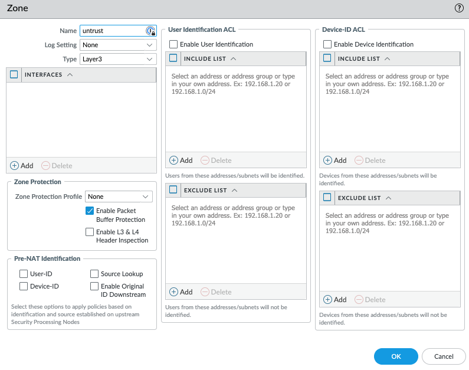
4. Repeat this step creating two more zones: trust and VPN
5. When done you should have three zones.
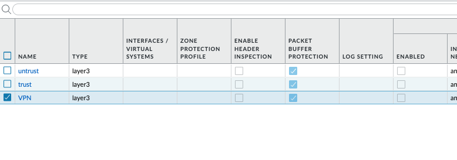
6. Press Commit to apply these changes

### Configure Interfaces
Azure to PA Mapping:
Azure eth1 (untrust): PA ethernet1/1
Azure eth2 (trust): PA ethernet1/2
Azure eth3 (VPN): PA ethernet1/3

1. Log into Azure and click on each interface that is assigned in the resource group.\
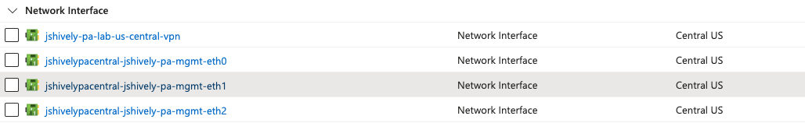
1. Click on eth1 and record the Private IPv4 address. This will be the address we assign to PA ethernet1/1\
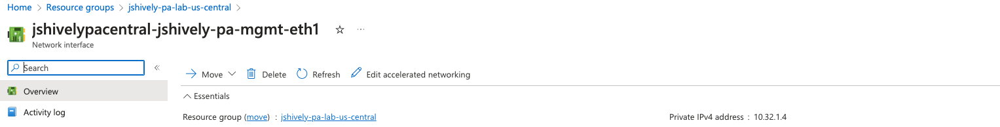
1. On the PA navigate to Network -> Interfaces and select ethernet1/1
2. Change the interface type to L3 and add in a comment
3. Under config change Virtual Router to default and Security Zone to untrust.\
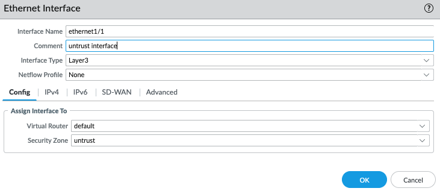
4. Click on IPv4 tab and select add. Enter in the address from the Azure portal for the untrust interface in CIDR notation. Azure by default will be a /24. Press ok.\
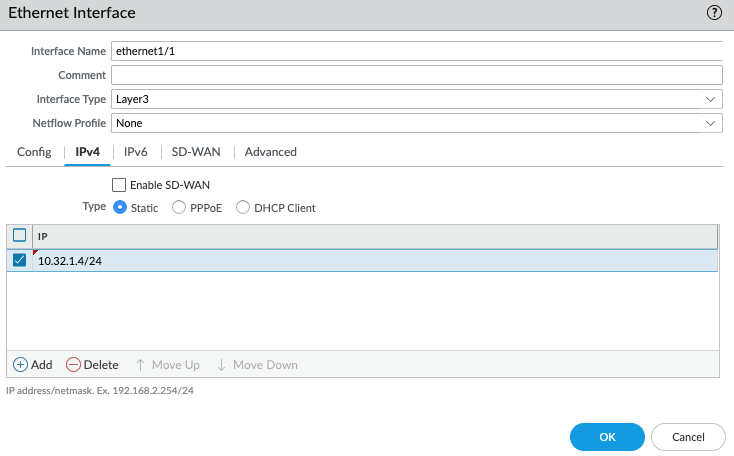
5. Click on ethernet1/2 and repeat the same steps for config and IPv4 (use eth2 or trust IP address from Azure)
6. For ethernet1/2 we want to allow ping on this interface. Click on Advanced, management profile, and select new\
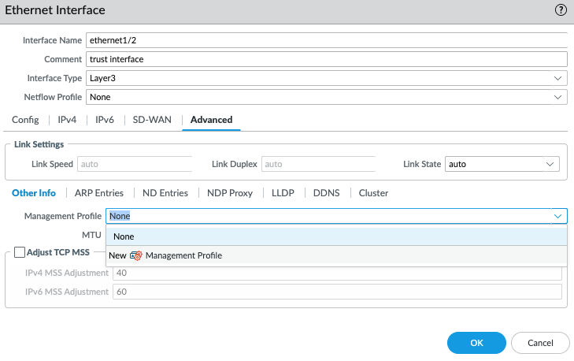
7. Name the Interface Management Profile ping_only and select ping under Network Services.\
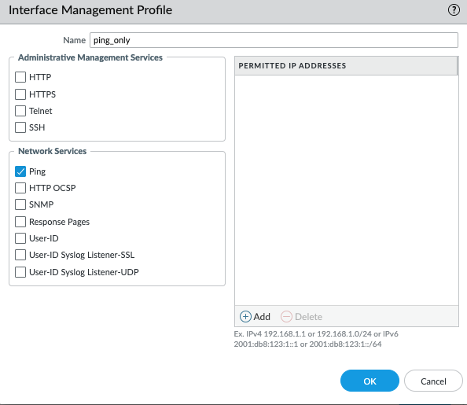
8. Repeat for ethernet 1/3 which will be called VPN.
9. You should have three interfaces configured.\
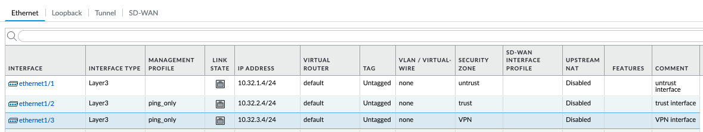
10. Commit the changes and you should see all three interfaces green.\
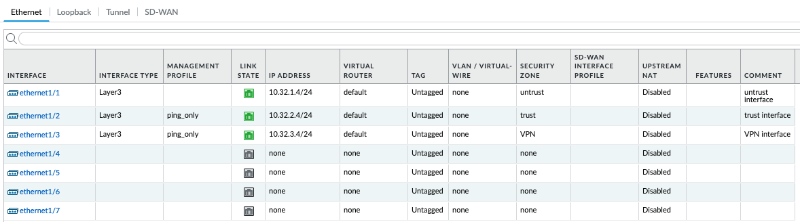

### Default Route
1. From Network click on Virtual Routers and then select default.\
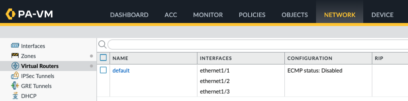
2. Click on static routes and select add.
3. Name will be default_route
4. Destination will be 0.0.0.0/0
5. Interface will be ethernet1/1
6. Next hop is IP Address
7. Next hop IP Address will be .1 of your untrust IP address (ethernet1/1)\
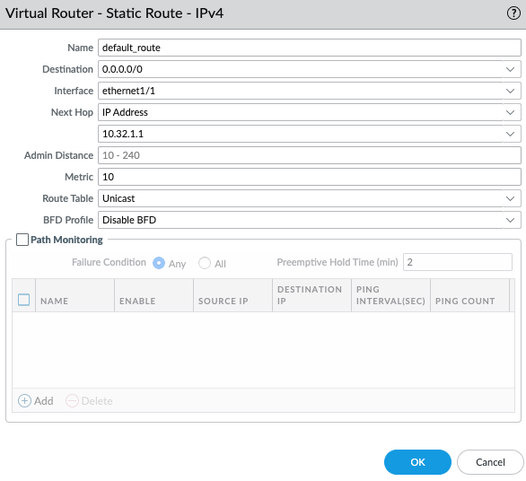
8. Press ok and commit.
