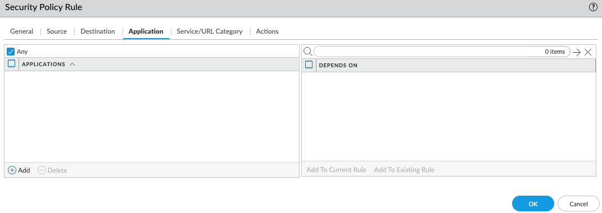

# General Policy Config for PA Firewall

### Table of Contents

### Information Needed to complete:
* PA MGMT (IP or FQDN)
* PA username and password

### NAT Policy
We will create a NAT policy that allows trust to NAT outbound to the Internet.

1. From the PA select Policies and NAT on the left side.\

2. Click on add in the bottom left.
3. Under General give it a logical name, and description.\

4. Under Original Packet set the source zone to trust and the destination zone to untrust\

5. Under translated packet set the Source as Persistent Dynamic IP and Pork
6. Address type to Interface Address
7. Interface to ethernet1/1 (untrust)
8. IP address select the interface IP you assigned to ethernet1/1\

9.  Press ok and it should look similar\

10. Commit your changes.

### Trust to Untrust Internet Policy
We will create a basic security policy that allows trust zone to access any website.

1. From the PA select Policies and Securiy on the left side.\

2. Click on add in the bottom left.
3. Under General give it a logical name and description.\

4. Under source set the source zone to trust.\

5. Under destination set the source zone to untrust.\

6. Under application make sure any is checked.\

7. Under Service/URL Category make sure application-default is selected above service and any is checked under URL category.\

8. Under Action make sure traffic is set to allow.

9. Press Ok and it should look similar.\

10.  Commit your changes.

### Testing from SSH
1. SSH into your PA firewall.
2. From the cli type in ```ping source {IP of ethernet1/1} host 8.8.8.8```\

3. If you want to quickly find your ethernet1/1 address from the CLI enter in ```show interface logical```\
