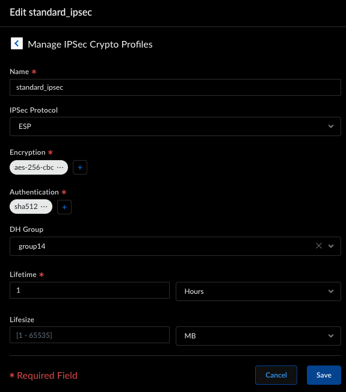

# Create Remote Network Tunnel on SCM

### Table of Contents
- [Create Remote Network Tunnel on SCM](#create-remote-network-tunnel-on-scm)
    - [Table of Contents](#table-of-contents)
    - [Information Needed to complete:](#information-needed-to-complete)
    - [Allocate Bandwidth](#allocate-bandwidth)
    - [Create Tunnel](#create-tunnel)
    - [Create base policy](#create-base-policy)

### Information Needed to complete:
* SCM tenant
* Untrust IP/FQDN on Azure PA firewall
* IP Range allocated for Azure PA firewall in CIDR

### Allocate Bandwidth
The push for this will take 20-30 minutes.

1. Log into SCM and from the left side select Workflows -> Prisma Access -> Remote networks.\

2. Click on `bandwidth management` at the top.
3. Under the assign column click on the location and enter in the bandwidth you want allocated.\

4. Click on Push and Push Config in the top left to commit these changes. NOTE: The push for this might take 20-30 minutes.

### Create Tunnel
The push for this will take 20-30 minutes.

1. Log into SCM and from the left side select Workflows -> Prisma Access -> Remote networks.\

2. Under Remote Networks click on `Add Remote Networks`\

3. Enter in a logical site name.
4. Under Prisma Access Location select one of the regions you allocated bandwidth.
5. IPSec Termination Node should auto-populate.\

6. Click on `Setup` under Primary Tunnel.\

7. Under IPSec Tunnel click `Create New`
8. Tunnel Name: logical name of the tunnel
9. Branch Device Type: Other Device
10. Authentication: pre-share
11. Pre-Shared Key: Enter in a PSK. This will be used on the other device so make sure you save it somewhere safe.
12. IKE Location Identification: None
13. IKE Peer Identification: FQDN (hostname) Value is Azure Untrust FQDN
14. Branch Device IP Address: Dynamic\

15. Scroll down and click on IKE Advanced Options
16. IKE Proposal Version: IKEv2 only mode
17. Click on `Create New` under IKEv1 Crypto Profile\

18. Name it standard_ike.
19. Encrpytion: aes-256-cbc
20. Authentication: sha512
21. DH Group: group14
22. Lifetime: 8 hours
23. Click save\

24. Click save
25. Click on `IPSec Advanced Options`
26. Click create new
27. Name: standard_ipsec
28. IPSec Protocol: ESP
29. Encrpytion: aes-256-cbc
20. Authentication: sha512
21. DH Group: group14
22. Lifetime: 8 hours
23. Click save\

24. At Create IPSec Tunnel click save again.\

25. Under routing click `Set Up`
26. Click on `+` under Static Routing
27. Add in the Azure network you defined in CIDR format.\

28. Click Save\

29. Click Save
30. Push configuration. NOTE: This might take 20-30 minutes to push.

After the configuration has pushed the remote network will be assigned a Service IP. This is the IP we will use on the Azure PA for peering.

### Create base policy