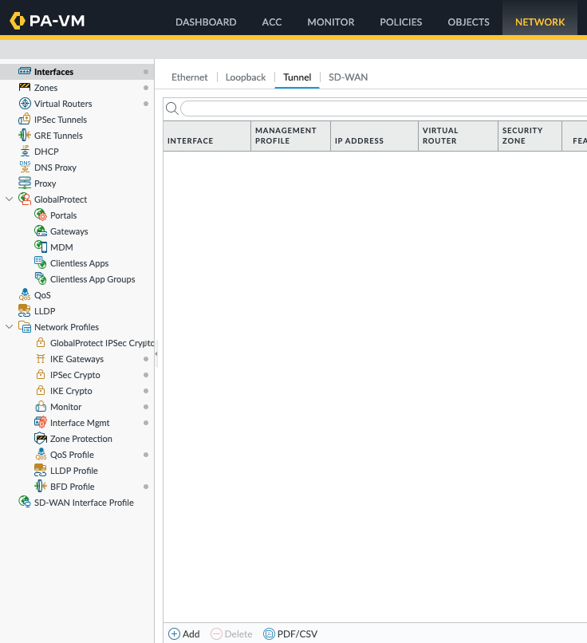
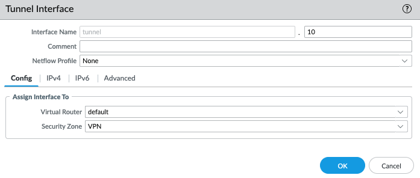

# Configure IPSec Tunnel on Palo Alto Firewall

### Table of Contents
- [Configure IPSec Tunnel on Palo Alto Firewall](#configure-ipsec-tunnel-on-palo-alto-firewall)
    - [Table of Contents](#table-of-contents)
    - [Information Needed to complete:](#information-needed-to-complete)
    - [Create IKE Crypto Policy](#create-ike-crypto-policy)
    - [Create IPSec Crypto Policy](#create-ipsec-crypto-policy)
    - [Create IKE Gateway](#create-ike-gateway)
    - [Create Tunnel Interface](#create-tunnel-interface)
    - [Create IPSec tunnel](#create-ipsec-tunnel)
    - [Create Tunnel Policy](#create-tunnel-policy)
    - [Allow VPN to Trust Policy](#allow-vpn-to-trust-policy)
    - [Manually test the tunnel](#manually-test-the-tunnel)

### Information Needed to complete:
* Azure PA firewall
* Peer IP address in SCM
* IP Range allocated for Azure PA firewall in CIDR
* FQDN assigned to untrust interface in Azure

### Create IKE Crypto Policy
1. From the PA firewall click on Network and on the left side select `IKE Crypto`
2. In the bottom left click on `Add`\

3. Name: `standard_ike`
4. DH Group: `group 14`
5. Authentication: `sha512`
6. Encryption: `aes-256-cbc`
7. Key Lifetime: 8 hours\

8. Click ok
9. Commit

### Create IPSec Crypto Policy
1. From the PA firewall click on Network and on the left side select `IPSec Crypto`
2. In the bottom left click on `Add`\

3. Name: `standard_ipsec`
4. IPSec Protocol: `ESP`
5. Encryption: `aes-256-cbc`
6. Authentication: `sha512`
7. DH Group: `group 14`
8. Key Lifetime: 1 hours\

1. Click ok
2. Commit

### Create IKE Gateway
1. From the PA firewall click on Network and on the left side select `IKE Gateway`
2. In the bottom left click on `Add`\

3. Name: `pa_to_scm`
4. Version: `IKEv2 only mode`
5. Address Type: `IPv4`
6. Interface: `Ethernet1/1` (untrust interface)
7. Local IP Address: Select the IP address of untrust from the pull down.
8. Peer IP Address Type: `IP`
9. Peer Address: `{Service IP from SCM}`
10. Pre-shared Key: `Key that was used when configuring the tunnel on SCM`
11. Local Identification: `FQDN (hostname)` and value is `{FQDN of Untrust from Azure portal}`

12. Click `Advanced Options`
13. IKE Crypto Profile: `standard profile`

14. Click ok
15. Commit

### Create Tunnel Interface
1. From the PA firewall click on Network and on the left side select Interfaces and then on `Tunnel`
2. In the bottom left click on `Add`\

3. Give it a number
4. Under Config:
   1. Virtual Router: `default`
   2. Security Zone: `VPN` (configured in 2_bas_configure_pa)\

5. Click Ok
6. Commit

### Create IPSec tunnel
1. From the PA firewall click on Network and on the left side select `IPSec Tunnels`
2. In the bottom left click on `Add`\

3. Name: `pa_to_scm`
4. Tunnel Interface: `{select number from Create Tunnel Interface}`
5. Type: `Auto Key`
6. IKE Gateway: `standard_ipsec`\

1. Click Ok
2. Commit

### Create Tunnel Policy
1. Click on Policies -> Security
2. In the bottom left click on `Add`\

3. Under General set the name to `tunnel_traffic`
4. Under Source set the Source Zone to `untrust`
5. Under Destination set the Destination zone to `untrust`
6. Under Appliations selet add and `ike` and `ipsec`
7. Under Actions select `Allow` under action
8. Click ok
9. Move rule to top\

10. Commit

### Allow VPN to Trust Policy
1. Click on Policies -> Security
2. In the bottom left click on `Add`\

3. Under General set the name to `vpn_to_trust`
4. Under Source set the Source Zone to `trust` and `vpn`
5. Under Destination set the Destination zone to `trust` and `vpn`
6. Under Actions select `Allow` under action
7. Click ok
8. Move rule under `tunnel_traffic` rule\

9.  Commit

### Manually test the tunnel
1. SSH into the PA firewall.
2. Enter in `test vpn ike-sa` and press enter.\

3. From the GUI select network -> IPSec Tunnels
4. You should see the tunnel status turn to green.\
